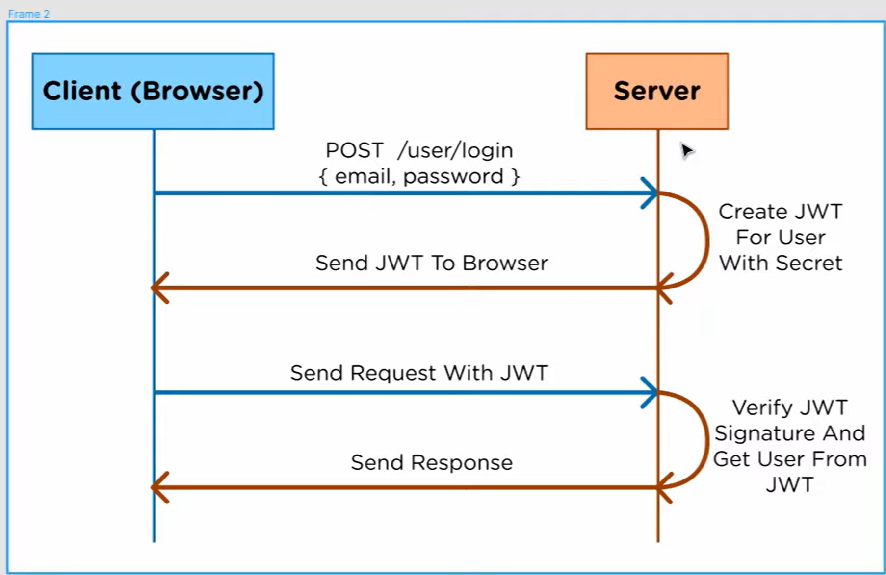
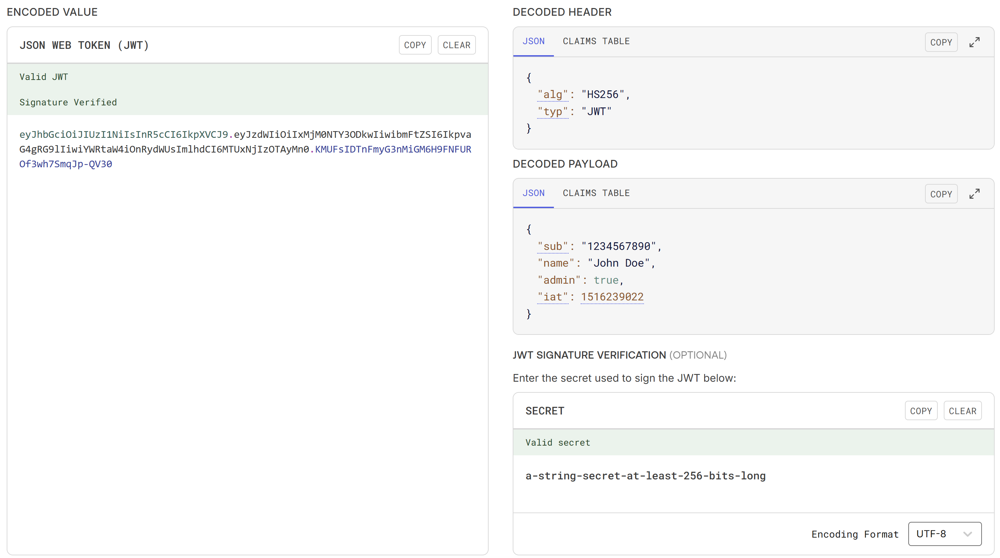

# Authentification, Authentication, Autorisation

## Informieren

### Requirements
- Ein User kann sich mit email und passwort authentifizieren.
- Nach erfolgreicher Authentifizierung werden weitere Authentifizierungen mit JWT automatisiert.
- Eine Authentifizierung hat eine zeitlich begrenzte Gültigkeit.
- Es werden mindestens zwei Rollen (Admin, User) unterschieden.
- Es sind abhängig von den Rollen unterschiedliche Autorisation vorhanden.

### JWT Authentication

Das JWT (JSON Web Token) wird für die autorisierung von Benutzern gebraucht.

> 
> - Client will sich einloggen (authentisieren) und sendet POST-Request an Server
> - Server authentifiziert den User und generiert ein JWT-Token, in dem der User enthalten ist
> - Server schickt JWT als Cookie in der Response mit 
> - Client nimmt JWT an und autorisiert damit seine nachfolgenden Requests

.

> 
> - **Encoded Value**: Das enkodierte (nicht encryptet!) Token, aufgeteilt durch '.' in drei Teile.
> - **Decoded Header**: Der erste Teil des Token, der Header. Hier ist der Algorithmus hinterlegt. 
> - **Decoded Payload**: Der zweite Teil des Token, das JSON mit den User-Infos und Infos über das Token.
> - **JWT Signature Verification**: Der Key der für die Singatur des Token verwendet wird. Damit wird verhindert, dass JWTs gefaked werden können.

Der Dritte Teil besteht aus dem ersten und dem zweiten Teil, enkodiert und signiert mit dem geheimen Key.

### Basic Authentication

Enkodierte Credentials, die (Base64-enkodiert) in den "Authorization"-Header im HTTP-Request geschrieben werden: 

**Beispiel-Credentials**: `Username:Password` -> `VXNlcm5hbWU6UGFzc3dvcmQ=`  
**Authorization Header**: `Basic VXNlcm5hbWU6UGFzc3dvcmQ=`

### Rollenbasierte Autorisierung

Im Payload des JWT kann die Rolle als ein Feld mitgegeben werden. Der Server kann dann anhand der Rolle (verfälschung durch Signierung des JWT ausgeschlossen) prüfen, ob der Nutzer die nötige Autorität zur Ressource hat.

